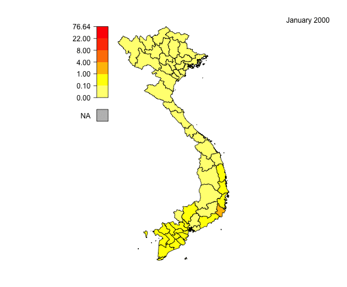

```{r include=F}
knitr::knit_hooks$set(margin = function(before,options,envir) {
if(before) par(mgp=c(1,0.35,0),bty="n",plt=c(0,.99,.13,.99), mar = c(2,2,3,2), xpd = TRUE) else NULL })

knitr::opts_chunk$set(margin=T,prompt=T,comment="",collapse=T,cache=F, bty="n",
dev.args=list(pointsize=11),fig.height= 4,
fig.width=6.24725,fig.retina=2,fig.align="center")
```

To make a movie from the data contained in the `gdpm` package, we also need the `poseid` package for the visualization and the package `animation` to make a movie.

```{r, eval = FALSE}
devtools::install_github("choisy/gdpm")
devtools::install_github("choisy/poseid")
install.packages("animation")
```

Loading and attaching the packages:

```{r,warning=FALSE, message=FALSE}
library(gdpm)
library(poseid)
library(animation)
```

We also need other packages for the preparation of the data, for the geographical data and for the population size information.   

```{r, warning=FALSE, message=FALSE}
# Important packages
library(dplyr) # for 'select', 'filter', 'mutate'....
library(gso) # for pop_size
```

## Load the data

The first important step is to look at the data and to decide a way to choose the more interesting intervals to show the variation of the number of cases across the year. 

For this example, we will take the `dengue` disease from 1995 to 2015. 

First, let's load the `dengue` dataset which is contained in the `gdpm` package and can be loaded with the `getid` function. 
For more details please see the documentation and the vignettes in the `gdpm` package. 

```{r}
# Load the dataset from the gdpm package
dengue <- getid(dengue, from = 1995)
dim(dengue)
range(dengue$year)
head(dengue)
```

## Weighting by population size

It is important to normalize the data before visualization, for that we will use the size of the population and calculate the incidence rate per province. 
We can obtain the population size information from the `gso` package. The data need to be expressed by the same province as the `dengue` data frame. For that, we can use the `merge_prov` function in the `poseid` package. 

For more informations:
```{r}
?merge_prov
?pop_size
```

Load the `pop_size` data frame from the `gso` package:

```{r}
pop <-  gso::pop_size
head(pop)
```

The data in the `pop` data frame need to be merged back together to be expressed by the province in 1995, to have the same data geographical definition as the `dengue` data frame.  

```{r}
pop <- merge_prov(pop, from = "1995-01-01")
head(pop)
```
```{r}
identical(unique(pop$province), unique(dengue$province))
```

Only the population total is selected and the column `value` is renamed `population`:

```{r}
pop <- filter(pop, key == "total")
pop <- select(pop, province, year, population = value)
head(pop)
```

The `pop_size` contains the population sizes expressed in thousand people, so we multiply the data by 1000 to have the data expressed in people. 

```{r}
pop <- mutate(pop, population = population * 1000)
head(pop)
```

After joining the `pop` and the `dengue` data frames by province and by year, we can now calculate the incidence rate per month, year and province : $$Incidence\ rate = \frac{number\ of\ case}{population\ total\ \times\ 10000\ persons}$$

```{r, warning=FALSE, message=FALSE}
# join the population dataframe to the dengue dataset and calculate the 
# incidence rate
dengue <- left_join(dengue, pop, by = c("province", "year"))
dengue <- mutate(dengue, incidence_rate =  
                   (incidence_dengue / population)*10000)
head(dengue)
```

## Intervals selection

It can be interesting to test different methods to select the best intervals. For that, we can use the function `breaks` in the `poseid` package. Many different methods of selection of intervals are implemented in the `breaks` function and you can try different method just by changing the `style` parameters. 

For more information, see the `Vizualizing the gdpm package` vignettes in the gdpm package and/or:
```{r, eval = FALSE}
?breaks # information on the breaks function
?classInt::classIntervals # information on the style used in the breaks function
```

As the data contain `r nrow(dengue)` rows, some methods can take a long time to calculate the intervals. So 50% of the data are randomly selected and the methods of selection for the intervals can be used on this sample to save time and calculation.

```{r}
sample_dengue <- sample_frac(dengue, 0.5)
```

Here, we show the example of the `quantile` and the `fisher` methods. The function `breaks` has a parameter `distrib`, which permits to print the distribution of the value by breaks. It allows you to see the difference in distribution between different `style`. 

First, the `quantile` method which provides quantile breaks on the incidence rate: 

```{r}
quant <- breaks(sample_dengue, "incidence_rate", n = 6, style = "quantile", 
                pal = rev(heat.colors(6)), distribution = TRUE)
```

We can print the intervals:
```{r}
attr(quant, "breaks")
```

Second, the `fisher` method which use the algorithm proposed by W. D. Fisher (1958) and discussed by Slocum et al. (2005) as the Fisher-Jenks algorithm:

```{r}
fisher <- breaks(sample_dengue, "incidence_rate", n = 6, style = "fisher", 
                 pal = rev(heat.colors(6)), distribution = TRUE)
```

We can print the intervals:
```{r}
attr(fisher, "breaks")
```

### Choice of breaks

We can create a consensus vector of intervals to represent our data.

```{r}
# Create a consensus:
breaks_den <- c(0, 0.1, 1, 4, 8, 22, max(na.omit(dengue$incidence_rate)))
# Look at the distribution of the data:
dengue_breaks <- breaks(dengue, "incidence_rate", n = 6, style = "fixed", 
                        fixedBreaks = breaks_den, pal = rev(heat.colors(6)), 
                        distribution = TRUE) 
```

To print the distribution of the value with the intervals printed with different colors:

```{r}
# Create a palette
pal <- colorRampPalette(rev(heat.colors(6))) 
pal_breaks <- pal(6)[cut(na.omit(dengue_breaks$incidence_rate), 
                         breaks = attr(dengue_breaks, "breaks"))]
# Plot the distribution of the value
plot(na.omit(dengue_breaks$incidence_rate), xlab = "time", pch = 20, 
     col = pal_breaks)
```

## Visualization

For the visualization, we will need the package `gadmVN` for the map of the provinces of Vietnam and the package `magrittr` for the pipe.

```{r, message=FALSE}
library(magrittr) # `%>%` 
library(gadmVN)   # for 'gadm'
map <- gadmVN::gadm(date = 1995, merge_hanoi = TRUE)
```

To print a choropleth map for the dengue dataset for January 2009, we can use a pipe to prepare the data and draw a choropleth map with a legend:
For more detail, please see the vignette: `Vizualizing the gdpm package` and/or:
```{r}
?choromap
```

```{r}
filter(dengue, year == 2009, month == "January") %>% 
  select(province, contains("rate")) %>%             
  choromap(map, col = rev(heat.colors(6)), fixedBreaks = breaks_den) %>% 
  legend2(legend = ., col = attr(., "colors"), col_na = "grey", n_round = 2)
```

To draw a choropleth map of another month or another year, we just have to change the first line of the pipe: `filter(dengue, year == 2009, month == "January")`. 
So, to make a movie of one year, we just have to create a loop printing a map for each month.

For more details, you can look at the webpage of the `animation` package: https://yihui.name/animation/ and:

```{r}
?animation::saveGIF
```


```{r, message=FALSE}
months <- month.name # vector of month name

saveGIF({
  # loop printing a map for each months
    monthly_loop <- for(i in seq(months)){
    filter(dengue, year == 2009, month == months[i]) %>% 
      select(province, contains("rate")) %>% 
      choromap(map, col = rev(heat.colors(6)), fixedBreaks = breaks_den) %>% 
      legend2(legend = ., col = attr(., "colors"), col_na = "grey", n_round = 1)
    # time label  
    text(x = par("usr")[2], y = par("usr")[4], labels = 
           paste0(months[i], " ", 2009), adj = c(1, 1))
    }
}, movie.name = "animation_monthly.gif", interval = 0.5, ani.width = 580, 
  clean = TRUE)
```


With the same principle, we can create another loop which prints a choropleth map for each month for multiple year: 

```{r, message=FALSE, eval = FALSE}
saveGIF({
  # loop for each year
  yearly_loop <- for(j in seq(range(dengue$year)[1], range(dengue$year)[2])){
    # monthly loop
    monthly_loop <- for(i in seq(months)){
    # creation of the map  
    filter(dengue, year == j, month == months[i]) %>% 
      select(province, contains("rate")) %>% 
      choromap(map, col = rev(heat.colors(6)), fixedBreaks = breaks_den) %>% 
      legend2(legend = ., col = attr(., "colors"), col_na = "grey", n_round = 2)
    # include time label  
    text(x = par("usr")[2], y = par("usr")[4], labels = 
           paste0(months[i], " ", j), adj = c(1, 1))
    }
  }
}, movie.name = "animation_dengue.gif", interval = 0.1, ani.width = 580, 
  clean = TRUE)
```


