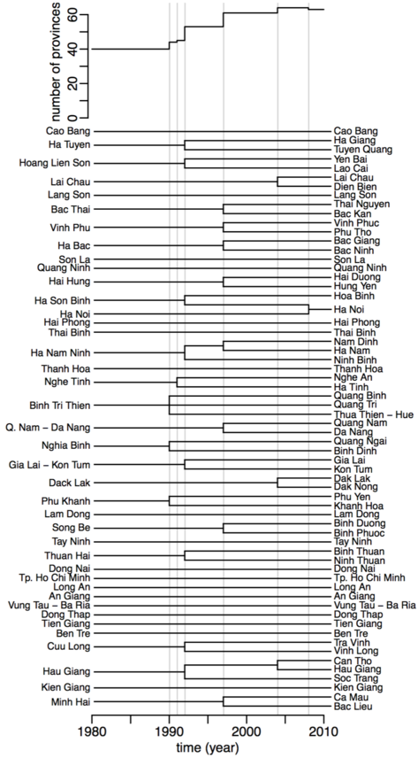

```{r include=F}
knitr::knit_hooks$set(margin = function(before,options,envir) {
if(before) par(mgp = c(1.5, 0.5, 0), bty = "n",plt = c(.105, .97, .13, .97)) else NULL })

knitr::opts_chunk$set(margin = T,prompt = T,comment = "", collapse = T, cache = F,
dev.args = list(pointsize = 11), fig.height = 3.5,
fig.width = 4.24725, fig.retina = 2, fig.align = "center")
```

The `gdpm` package contains the monthly surveillance data aggregated by province, by the Vietnamese General Department of Preventive Medicine (GDPM). 

In more details, this package contains the monthly syndromic data incidence and mortality data for 30 diseases since 1980 in Vietnam in the form of 30 data frames (`adenovirus`, `amoebiasis`, `chickenpox`, `cholera`, `dengue`, `diarrhea`, `diphteria`, `dysenteria`, `encephalitis`, `hepatitis`, `ili`, `measles`, `meningitis`, `mumps`, `pertussis`, `plague`, `polio`, `rabies`, `shigella`, `tetanus`, `typhoid`, `leptospiriosis`, `anthrax`, `nntetanus`, `malaria`, `h5n1`, `rubella`, `vhf`, `enterovirus`, `ssuis`), one summary data frame (`diseases`), one handling functions (`getid`). We here give a quick overview of the data sets and their handling.

Installing the `gdpm` package:

```{r eval=F}
devtools::install_github("choisy/gdpm")
```

Loading and attaching the `gdpm` package:

```{r}
library(gdpm)
```

If you don't want to use R for data analysis, the data frames mentioned above can be exported to disk in different formats. For, example, into CSV, in the current directory:

```{r eval=F}
write.table(gdpm::getid(ili), "ili.csv", quote = F, sep = ",", row.names = F)
write.table(gdpm::diseases, "diseases.csv", quote = F, sep = ",", row.names = F)
```

If you want to use R for data analysis, the rest of the document presents in more details the data and the tools to use it.

## Epidemiological data

The epidemiological data are contained in the 30 epidemiological data frames, each data frame corresponding to one syndromic disease. For example, `chickenpox`:

```{r}
chickenpox <-  getid(chickenpox)
head(chickenpox)
```

The data are expressed by the `incidence` or number of cases and `mortality` or the number of death per `province`, `month` and `year`.
See below, the section on the `getid` function, for an illustration of the specificity of this function.

The structure of the data frame is:

```{r}
str(chickenpox)
```

Note that time is coded by the 2 variables `year` and `month`. The latter is a factor in which the coding of the levels follows their chronological order:

```{r}
levels(chickenpox$month)
```

Head and tail of the data frame `chickenpox`:

```{r}
head(chickenpox)
tail(chickenpox)
```

## Summary data frame

The package contains also a summary data frame called `diseases`:

```{r}
diseases
```

The dataset contains the names of each epidemiological data frame (`disease`) and the time range (`from - to`) of the data. This table can be used as a resume of all the other data frame contains in this package and may be useful for computing on the various files.

```{r}
str(diseases)
```

## Utility function

The package `gdpm` also contains a utility function that eases the handling of the data: `getid`.

### Getid

The first utility of this function is to generate appropriate time series. One specificity of Vietnam is the splits of administrative provinces during its history, starting from 40 provinces in 1980 and ending with 63 provinces today, as illustrated below:

<center></center>

We can see that most of the events are splits event of one province into two or three provinces. There is only one merging event of provinces: Ha Noi and Ha Tay in 2008, which merged together to create a new spatial definition of Ha Noi.
The spatial definition of the provinces is changing over time. The epidemiological datasets contain provinces that are thus defined over various time durations and different spatial units in time.

In order to analyze the data correctly, it is useful to work on time series that cover the same time range and with the same spatial definition through time. 
The function `getid` takes care of this by back-merging all the provinces together and returns the data in the same spatial conformation through time.
For example, if you want the time series of the chickenpox for 1990 until 2000, all the data will be expressed per year and month and per the 44 provinces of 1990.  If the time range starts before 1992 and ends after 2008, the provinces: "Ha Son Binh", "Ha Noi", "Ha Tay" and "Hoa Binh" are all merged together and named "Ha Noi".


More information on this function can be find: 

```{r, eval = FALSE}
?getid
```

By default, the function will choose the time range of the disease implemented, for example, from 1980 until 2015 for the chickenpox, from 1980 until 2010 for the dysenteria. It means that the all the province that splits during the time range selected will be merged together accordingly to the history of Vietnam (cf. see pictures)) and the data set will be return ordered by `province`, `year`, `month`. 

```{r}
merged_chickenpox <- getid(chickenpox) 
head(merged_chickenpox)
# By default, the time range selected will be: "1980 - 2015", time range of the data (see diseases)
range(merged_chickenpox$year)
# The province will be merged accordingly to the history of Vietnam to return the data ordered by the forty provinces of 1980 (except "Ha Son Binh which is merged with Ha Noi")
unique(merged_chickenpox$province)
```

#### Time Range

This function also supports the implementation of multiple diseases at the same time. By default, the time range is selected to contain all the data from all the diseases implemented.
For example, if we selected: 

 --  | Dysenteria | Malaria | Rubella
:--: | :--------: | :-----: | :------:
From |    1980    |   2003  |  2006
To   |    2010    |   2015  |  2015

The time range will be `from = "1980", to = "2015"`.

```{r}
range(getid(dysenteria, malaria, rubella)$year)
# equivalent to :
#range(getid_("dysenteria", "malaria", "rubella")$year)
```

There is differents way to select the time range:

1. by using the `shortest` parameter: 
  + by default, the value of this parameter is `FALSE`, which mean that the time range selected is the widest possible. So, if we keep the last example: the time range will: "1980-2015".
  + by selecting `shortest = TRUE`, the time range selected contains only the year in commons for all the diseases. In the example, the time range will be: "2006-2010".

```{r}
# if shortest = FALSE
# equivalent : getid(dysenteria, malaria, rubella)$year
range(getid(malaria, dysenteria, rubella, shortest = FALSE)$year)
# if shortest = TRUE
range(getid(malaria, dysenteria, rubella, shortest = TRUE)$year)

```

2. by using the parameters `from` and `to`, it can be used in `Date`, `character` or `numeric` format. 

```{r}
merged_diseases <- getid(malaria, dysenteria, rubella, from = "1980-01-01", to = "2006-12-31") 
# equivalent to :
#merged_diseases <- getid_("malaria", "dysenteria", "rubella", from = "1980-01-01", to = "2006-12-31")
#merged_diseases <- getid_("malaria", "dysenteria", "rubella", from = "1980", to = "2006")
#merged_diseases <- getid_("malaria", "dysenteria", "rubella", from = 1980, to = 2006)
#merged_diseases <- getid(malaria, dysenteria, rubella, from = "1980", to = "2006")
#merged_diseases <- getid(malaria, dysenteria, rubella, from = 1980, to = 2006)
# time range of the output
range(merged_diseases$year)
# Visualisation
head(merged_diseases)
tail(merged_diseases)
```

If you used both parameters at the same time, the parameters `from` and `to` will be preferably selected.
```{r}
range(getid(malaria, dysenteria, rubella, from = 2004, shortest = TRUE)$year)
range(getid(malaria, dysenteria, rubella, to = 2006, shortest = FALSE)$year)
```

#### Provinces

For two diseases: "hepatitis" and "amoebiasis", the story of splits/combined provinces are different, the events of 1990 take place in 1991. If one or both of them are inputed in the `getid` function, the merging events of 1990 are reported in 1991 for all the diseases selected at the same time. 

```{r}
df1 <- getid(dysenteria, malaria, rubella, from = 1990)
length(unique(df1$province))
df2 <- getid(dysenteria, hepatitis, malaria, rubella, from = 1990)
length(unique(df2$province))
```
